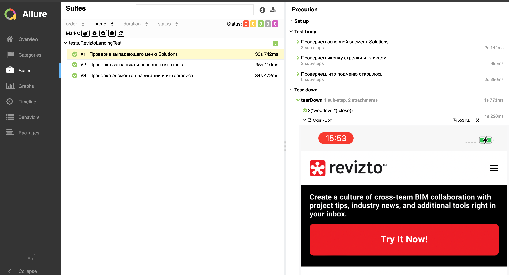

<p align="center"> 
 
</p>

# 📱 Revizto Mobile Tests

Автоматизированное тестирование мобильной версии сайта [Revizto](https://revizto.com) с использованием Selenide, JUnit 5 и Allure Reports.


---

## 📋 Содержание

- [Технологии и инструменты](#-технологии-и-инструменты)
- [Покрытый функционал](#-покрытый-функционал)
- [Запуск тестов](#-запуск-тестов)
- [Jenkins Integration](#-jenkins-integration)
- [Allure отчет](#-allure-отчет)
- [Особенности реализации](#-особенности-реализации)

---

## 🛠 Технологии и инструменты

<p>
&nbsp;
&nbsp;
&nbsp;
&nbsp;
&nbsp;
&nbsp;
&nbsp;
</p>

### Основной стек:

- **Java 17** - язык программирования
- **Selenide** - фреймворк для автоматизации UI тестов
- **JUnit 5** - фреймворк для запуска тестов
- **Gradle** - система сборки
- **Allure Reports** - система отчетности
- **Owner** - библиотека для работы с конфигурацией
- **WebDriverManager** - автоматическое управление драйверами
- **Browserstack** - облачная платформа для удаленного запуска тестов
- **Jenkins** - CI/CD для автоматического запуска тестов

---

## ✅ Покрытый функционал

Проект содержит автоматизированные тесты для мобильной версии сайта Revizto:

### 🏠 Landing Page Tests (`ReviztoLandingTest`)

1. **Проверка основных элементов лендинга** 🔴 CRITICAL
   - Проверка заголовка "Unifying BIM Intelligence across 2D and 3D"
   - Проверка слогана "Integrated Collaboration Platform"
   - Проверка кнопки "Request a Demo" и ссылки на форму

2. **Проверка навигации и интерфейса** 🔴 CRITICAL
   - Проверка мобильного меню (кнопка и открытие меню)
   - Проверка наличия и корректности логотипа
   - Проверка кнопки "Sign in" и ссылки на страницу входа

3. **Проверка интерактивных элементов** 🟡 NORMAL
   - Проверка выпадающего меню "Solutions"
   - Проверка подпунктов: Architects, Engineers, Contractors, Owners
   - Проверка открытия/закрытия меню по клику

### 📊 Покрытие:
- ✅ **3 тестовых сценария**
- ✅ **Локальный и удаленный запуск** (Browserstack)
- ✅ **Конфигурация через Owner**
- ✅ **Allure Steps** для детального логирования
- ✅ **Attachments**: скриншоты и видео

---

## 🚀 Запуск тестов

### Локальный запуск (мобильная эмуляция Chrome)

```bash
./gradlew localTest
```

### Удаленный запуск на Browserstack

```bash
./gradlew remoteTest
```

### Запуск с параметрами

```bash
./gradlew test -Denvironment=local
./gradlew test -Denvironment=remote
```

### Генерация и открытие Allure отчета

```bash
./gradlew allureReport
./gradlew openAllureReport
```

### Очистка старых результатов

```bash
./gradlew cleanAllure
```

---

## 🔄 Jenkins Integration

Проект полностью готов к интеграции с Jenkins для автоматического запуска тестов в CI/CD pipeline.

[](https://jenkins.autotests.cloud/job/035-mariia_p-mobile/)
[](https://jenkins.autotests.cloud/job/035-mariia_p-mobile/1/allure/)

### 🔗 Jenkins Job

**Ссылка на активную Jenkins Job:** [035-mariia_p-mobile](https://jenkins.autotests.cloud/job/035-mariia_p-mobile/)

**Запуск на Browserstack:**
```bash
ENVIRONMENT: remote
TASK: clean test
DEVICE_NAME: Samsung Galaxy S23
PLATFORM_VERSION: 13.0
```
---

## 📊 Allure отчет

### Примеры отчетов:

**🔗 Ссылка на Allure Report в Jenkins:** [View Allure Report](https://jenkins.autotests.cloud/job/035-mariia_p-mobile/1/allure/)

### Содержание отчета:

- ✅ **Overview** - общая статистика прохождения тестов
- ✅ **Suites** - группировка тестов по классам
- ✅ **Behaviors** - группировка по Epic/Feature/Story
- ✅ **Timeline** - временная шкала выполнения тестов
- ✅ **Attachments** - скриншоты и видео для каждого теста

### Attachments в отчете:

1. **Скриншот** - для каждого теста
2. **Видео** - для удаленного запуска (Browserstack)
3. **Page Source** - HTML код страницы (опционально)
4. **Логи браузера** - консольные логи (опционально)

### 📸 Скриншот Allure Report:

<p align="center">
  
</p>

### Пример отчета с группировкой:

- **Epic**: Мобильное тестирование Revizto
  - **Feature**: Лендинг страница
    - **Story**: Проверка основных элементов лендинга
    - **Story**: Проверка навигации
    - **Story**: Проверка интерактивных элементов

---

## 🎯 Особенности реализации

### 1. Конфигурация через Owner

Используется библиотека **Owner** для удобного управления конфигурацией:

```java
@Config.Sources({"classpath:remote.properties", "classpath:local.properties"})
public interface MobileConfig extends Config {
    @Key("baseUrl")
    @DefaultValue("https://revizto.com")
    String baseUrl();
}
```

### 2. Два драйвера для разных окружений

- **LocalMobileDriver** - Chrome с мобильной эмуляцией (iPhone 12 Pro)
- **BrowserstackMobileDriver** - реальные устройства в облаке

### 3. BaseTest с автоматической конфигурацией

```java
@BeforeAll
public static void setUp() {
    // Автоматический выбор драйвера на основе environment
    if (isRemoteRun) {
        Configuration.browser = BrowserstackMobileDriver.class.getName();
    } else {
        Configuration.browser = LocalMobileDriver.class.getName();
    }
}

@AfterEach
public void tearDown() {
    // Добавление Allure Attachments
    // Закрытие браузера после каждого теста
    closeWebDriver();
}
```

### 4. Allure Steps для читаемости

```java
step("Проверяем заголовок с BIM", () -> {
    $("h1").shouldHave(text("Unifying BIM Intelligence across 2D and 3D"));
});
```

### 5. Автоматические Attachments

- Скриншот добавляется автоматически после каждого теста
- Видео добавляется только для Browserstack
- Пауза 3 секунды для обработки видео на сервере

---

## 📝 Требования

- **Java 17+**
- **Gradle 8.0+**
- **Chrome Browser** (для локального запуска)
- **Browserstack аккаунт** (для удаленного запуска)

### Настройка Browserstack credentials:

Добавьте в `src/test/resources/browserstack.properties`:

```properties
browserstack.user=your_username
browserstack.key=your_access_key
```

---

## 👨‍💻 Автор

**MariiaP**  

---

## 📞 Контакты и ссылки

- **Jenkins Job:** [035-mariia_p-mobile](https://jenkins.autotests.cloud/job/035-mariia_p-mobile/)
- **Allure Report:** [View Allure Report](https://jenkins.autotests.cloud/job/035-mariia_p-mobile/1/allure/)
- **Browserstack Dashboard:** https://automate.browserstack.com/dashboard
- **Revizto Website:** https://revizto.com

---
